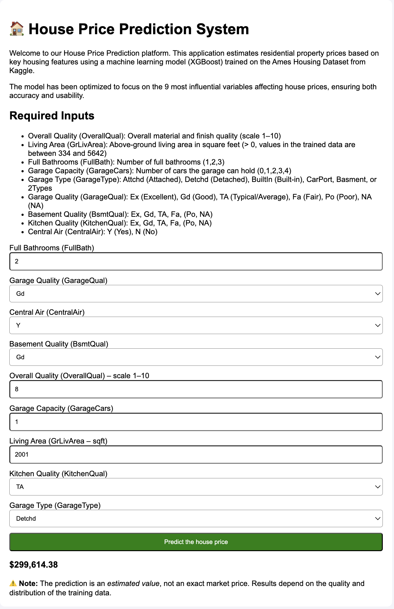

# Machine Learning Engineer Portfolio

This repository contains **6 end-to-end Machine Learning projects** covering classical machine learning, deep learning, natural language processing, computer vision, recommendation systems, and model deployment.

The goal of this portfolio is to demonstrate practical skills required for a **Machine Learning Engineer role**, including:

* Data preprocessing
* Feature engineering
* Model training and evaluation
* Hyperparameter tuning
* Deep learning
* Model deployment
* Reproducible environments

---

# Repository Structure

```
ml-engineer-portfolio
│
├─ environment.yml
├─ requirements.txt
├─ README.md
│
└─ projects
   ├─ 01_house_price_ml-deployment
   ├─ 02_customer_churn_prediction
   ├─ 03_recommendation_system
   ├─ 04_nlp_sentiment_analysis
   ├─ 05_object_detection_yolo
   └─ 06_ml_api_deployment
```

Each project is designed as a **self-contained machine learning pipeline**.

---

# Projects Overview

## 1. House Price Prediction and Deploy on a web app.


**Models**

* XGBoost

**Key Features**

* 🔍 Feature selection (reduced from 81 → 9 features)
* 🤖 Model training using XGBoost
* ⚙️ Data preprocessing with Scikit-learn pipeline
* 🌐 Flask API for inference
* 🖥️ Web UI for prediction
* 🐳 Docker containerization
* ☁️ Cloud deployment ready

**📸 Demo UI**




---

## 2. Customer Churn Prediction

**Goal**

Predict whether a telecom customer will churn.

**Techniques**

* Feature engineering
* Class imbalance handling
* Model comparison

**Models**

* Logistic Regression
* Random Forest
* XGBoost

**Evaluation**

* ROC-AUC
* Precision / Recall

---

## 3. Recommendation System

**Goal**

Build a recommendation engine for users based on past interactions.

**Approaches**

* Collaborative filtering
* Matrix factorization

**Libraries**

* implicit
* pandas
* numpy

---

## 4. NLP Sentiment Analysis

**Goal**

Classify text sentiment from product or movie reviews.

**Approaches**

* Transformer-based NLP
* Fine-tuning pre-trained models

**Libraries**

* transformers
* datasets

**Model**

* BERT

---

## 5. Object Detection

**Goal**

Detect objects in images using deep learning.

**Framework**

YOLO object detection.

**Libraries**

* ultralytics
* opencv

**Tasks**

* training
* inference
* visualization

---

## 6. ML API Deployment

**Goal**

Deploy a trained machine learning model as an API.

**Tools**

* FastAPI
* Uvicorn

**Features**

* REST API for predictions
* JSON input/output
* Model loading

---


