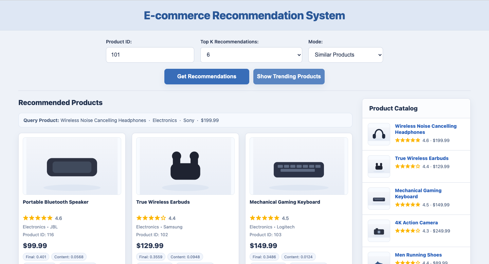
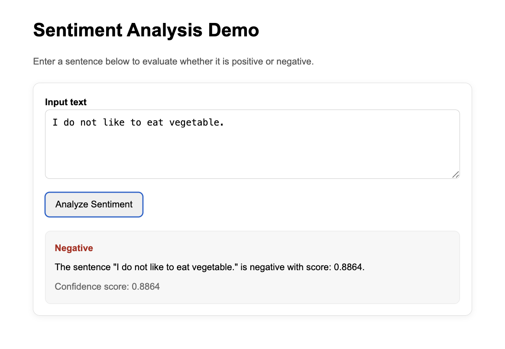
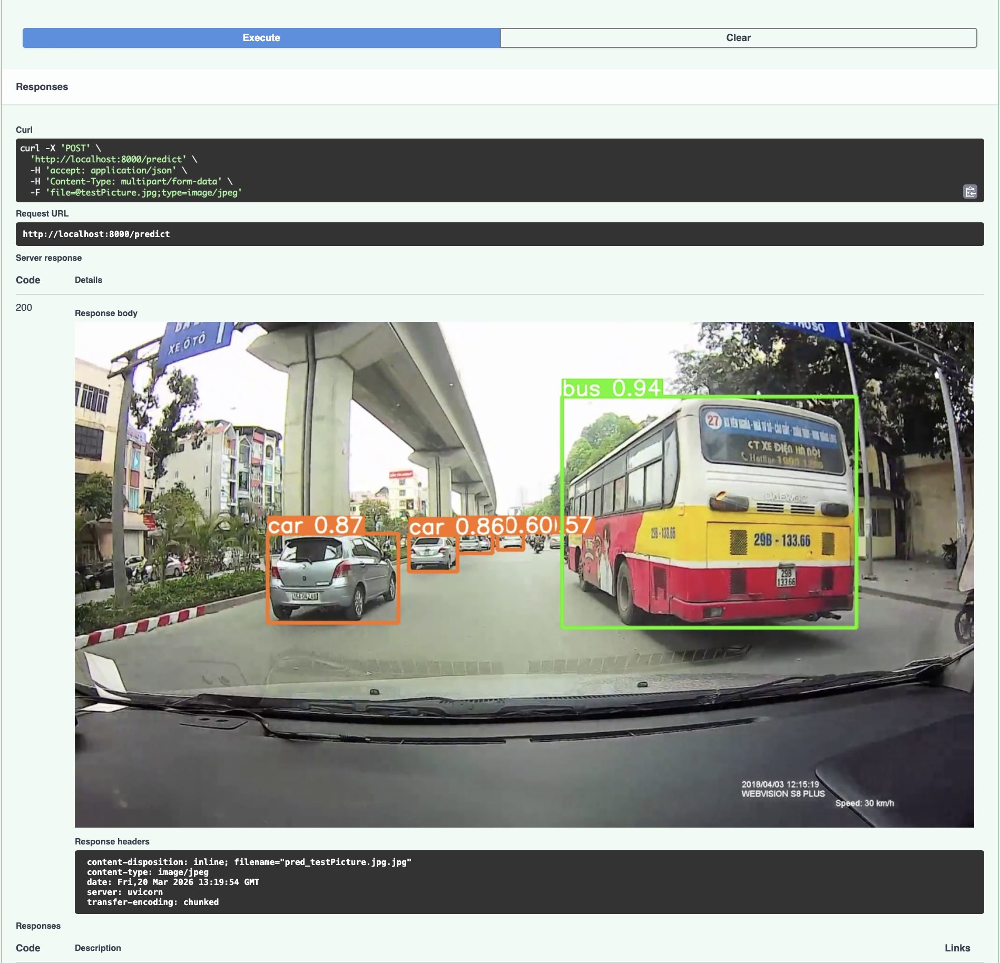

# Machine Learning Engineer Portfolio

This repository contains **5 end-to-end Machine Learning projects** covering classical machine learning, deep learning, natural language processing, computer vision, recommendation systems, and model deployment.

The goal of this portfolio is to demonstrate practical skills required for a **Machine Learning Engineer role**, including:

* Data preprocessing
* Feature engineering
* Model training and evaluation
* Hyperparameter tuning
* Deep learning
* Model deployment
* Reproducible environments

---

# Repository Structure

```
ml-engineer-portfolio
│
├─ environment.yml
├─ requirements.txt
├─ README.md
│
└─ projects
   ├─ 01_house_price_ml-deployment
   ├─ 02_customer_churn_prediction
   ├─ 03_recommendation_system
   ├─ 04_nlp_sentiment_analysis
   ├─ 05_object_detection_yolo

```

Each project is designed as a **self-contained machine learning pipeline**.

---

# Projects Overview

## 1. House Price Prediction and Deploy on a web app.

**Goals**

An end-to-end machine learning project that predicts house prices using an **XGBoost model**, deployed as a web application.


**✨ Key Features**

* 🔍 Feature selection (reduced from 81 → 9 features)
* 🤖 Model training using XGBoost
* ⚙️ Data preprocessing with Scikit-learn pipeline
* 🌐 Flask API for inference
* 🖥️ Web UI for prediction
* 🐳 Docker containerization
* ☁️ Cloud deployment ready

**📸 Demo UI**


---

## 2. Customer Churn Prediction

**Goal**

Predict whether a telecom customer will churn.

**✨ Key Features**

* Feature engineering
* Class imbalance handling
* Model comparison

**Models**

* Logistic Regression
* Random Forest
* XGBoost

**Evaluation**

* ROC-AUC
* Precision / Recall

---

## 3. Recommendation System

**Goal**

This project is an **e-commerce recommendation system** built with **FastAPI**, **scikit-learn**, and a lightweight web UI.

It simulates a real-world recommendation workflow for an online retail platform by combining multiple recommendation signals:

- content similarity from product metadata
- category and brand affinity
- price similarity
- popularity score
- collaborative-style co-occurrence from user interactions

It uses a realistic **Amazon-style product catalog** and interaction dataset.

**✨ Key Features**

- recommendation system fundamentals
- multi-signal ranking design
- API serving with FastAPI
- model artifact generation and loading
- product-oriented ML system thinking
- Dockerization
- clean project structure
- demo UI design for explainability

**📸 Demo UI**




---

## 4. NLP Sentiment Analysis

**Goal**
This project provides a **REST API for sentiment analysis** using a pre-trained Transformer model.

👉 It also includes a **lightweight web UI** for easy interaction and demo.

Perfect for:

* AI backend services
* NLP applications
* portfolio demonstration

---

**✨ Key Features**

* ⚡ FastAPI backend
* 🧠 Transformer-based sentiment analysis (Hugging Face)
* 🖥️ Minimal UI demo (no frontend framework needed)
* 📊 JSON API output
* 🐳 Docker support
* 🧪 Testing & linting ready
* ⚙️ Configurable via `.env`

---

**📸 Demo UI**




## 5. YOLO Object Detection API (FastAPI + YOLOv8)

**Goal**
A production-ready REST API for object detection using **YOLOv8 (Ultralytics)** and **FastAPI**.
This project follows clean architecture principles and is fully containerized with Docker — suitable for development, deployment, and portfolio demonstration.

---


**✨ Key Features**

* ⚡ FastAPI high-performance backend
* 🎯 YOLOv8 object detection (Ultralytics)
* 🖼️ Upload image → get annotated image with bounding boxes
* 📊 JSON output with detection results
* 🧪 Unit testing with pytest
* 🧹 Linting with Ruff
* 🐳 Docker & docker-compose support
* ⚙️ Environment-based configuration
* 🧱 Clean architecture (API / Services / Core / Schemas)


**📸 Demo UI**


---


# 👨‍💻 Author

**Dr. Tat Dat Tran**

GitHub: https://github.com/tatdattran

---

# ⭐ Star this repo if you find it useful!
